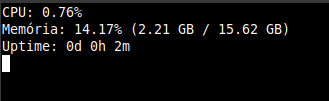

# topizinho

Uma ferramenta simples e minimalista para monitoramento de recursos do sistema, com foco em CPU e memória.

## Visão Geral

O `topizinho` mostra de forma simples a porcentagem de uso da **RAM** e da **CPU** do sistema.

Esta versão inicial, executada em **modo _user_**, foi desenvolvida primariamente como um exercício de programação concorrente, utilizando _threads_ para as práticas de monitoramento e atualização de dados.

## Evolução Futura

O objetivo principal do projeto é migrar esta funcionalidade para um **Módulo de Kernel**, aprofundando o aprendizado sobre a interação em nível de sistema operacional.

## Demonstração de Uso (Modo _User_)

Abaixo, o resultado da execução do `topizinho` em dois cenários: um com carga normal e outro sob estresse de CPU (iniciado com `stress --cpu 4`).

**Imagem de Exemplo:**

  

***